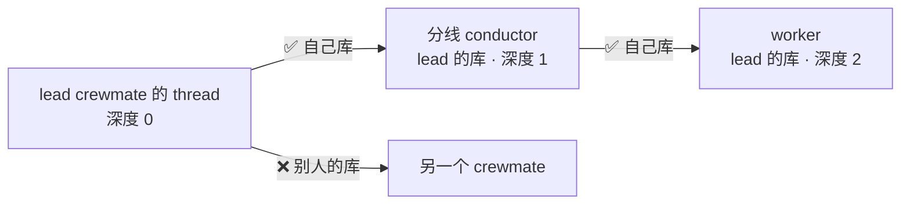
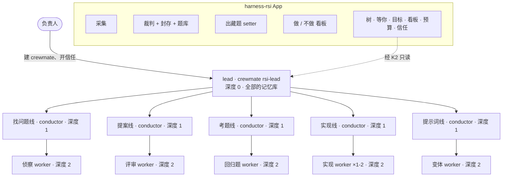
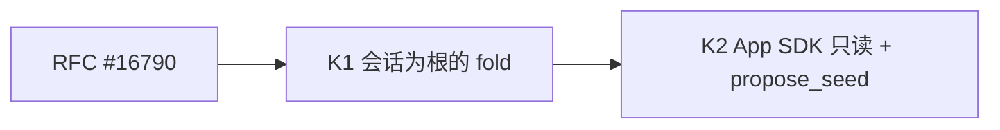
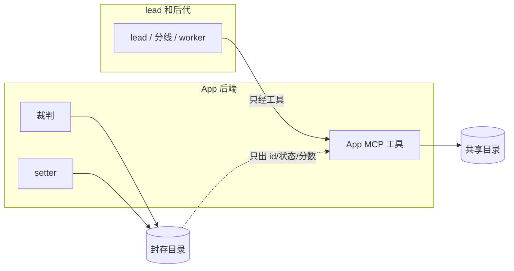
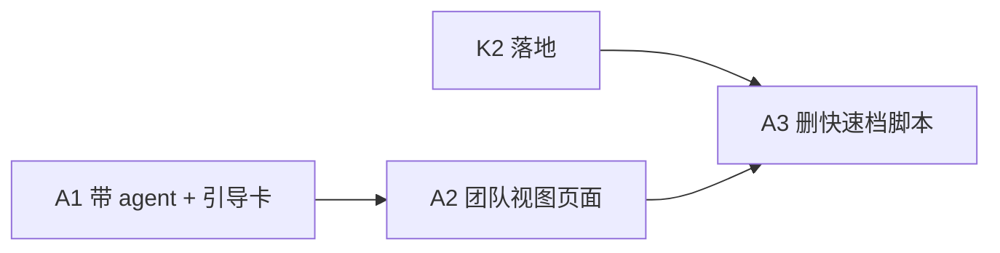
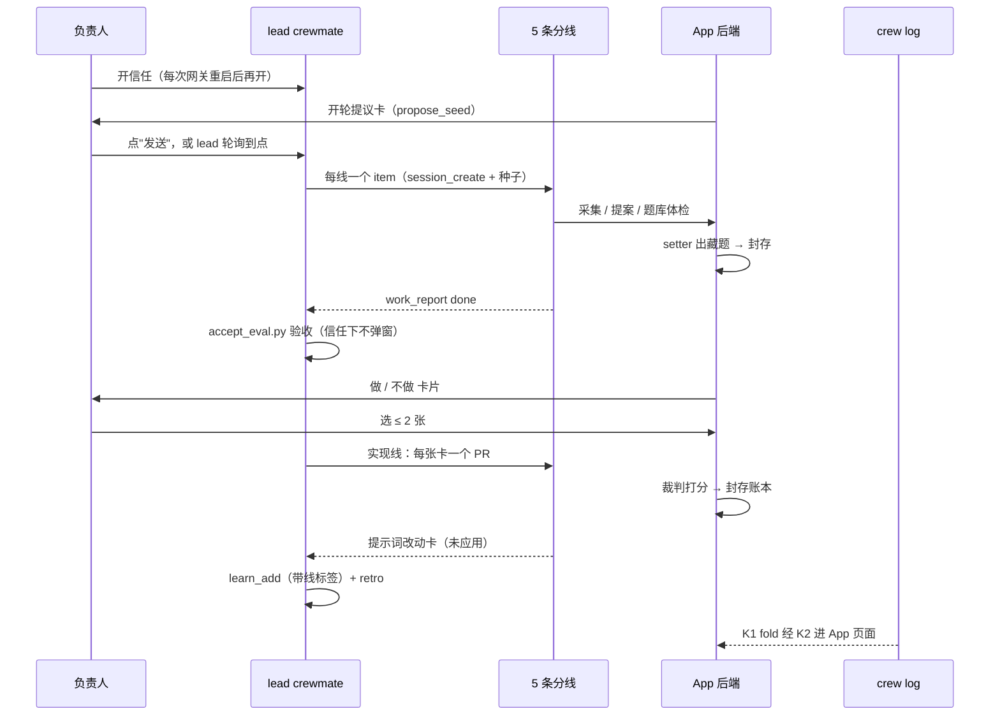
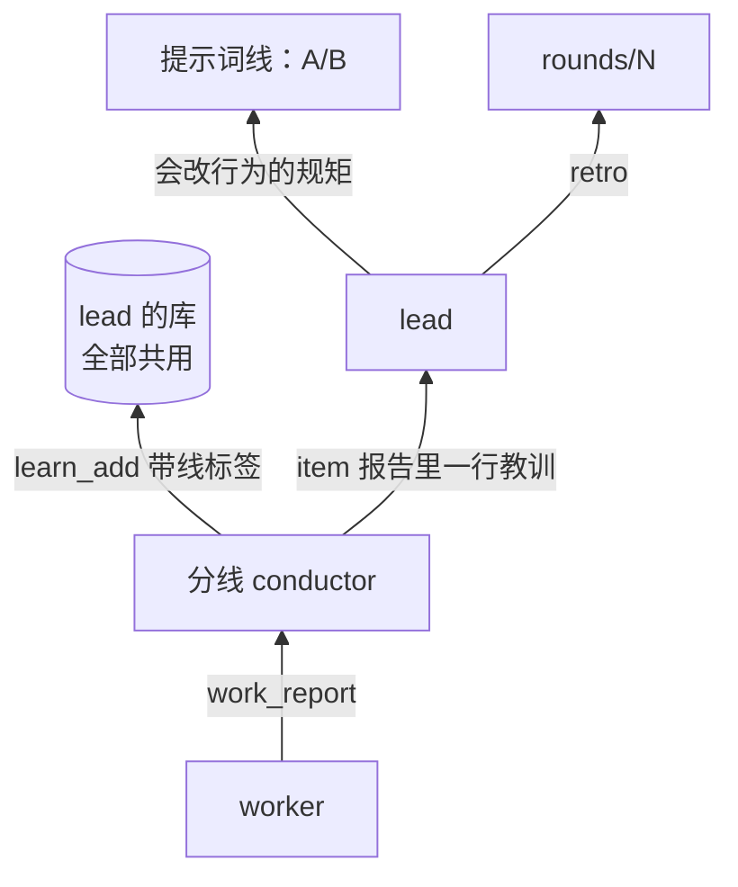
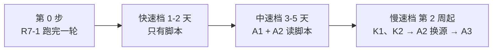
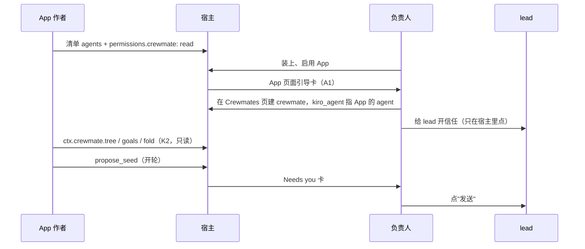

# Harness RSI 设计 v4：只有一个 crewmate，团队视图先在 App 里做

状态：草案 v0.4 · 2026-10-04 · 负责人：iamwhatever · 上级文档：Harness RSI 设计文档（KiroCrew 本地 artifact `harness-rsi`） · 本文件对应 artifact `harness-rsi-crewmate-team` 版本 6；v3.1 是版本 5，v3 是版本 4，v2 是版本 2

v0.4 变更（按负责人对 v3.1 的裁定）：去掉 team 这个概念。用户看到的只是一个普通 crewmate（lead）；分线和 worker 只是它开的会话。Crewmates 页一点不改。所有"团队式"的视图都先在 harness-rsi App 里做、先试；证明有用以后再挪进核心。

| 改了什么 | v3.1 | v4 |
|---|---|---|
| 用户看到的东西 | 一个 team，有 lead、team 视图、team 看板 | 一个普通 crewmate `rsi-lead` |
| Crewmates 页 | PR 1-5、8 都改它 | 不改 |
| team 记录、team 标记 | PR 1 加 lead；PR 4 在会话上盖 team id | 都删掉 |
| 树、Needs you、Goals、看板、预算、信任检查 | 核心 PR 2、3、5、8 | App 页面 A2 |
| 核心改动 | PR 0-5、8 + A1-A4 | 只有 K1、K2 |
| App 改动 | 清单 `contributes.teams` + 建队卡 | A1 带 agent + 引导卡；A2 页面；A3 删脚本 |
| RFC | PR 0 改 crewmates §09 | #16790 正在改写成只讲 K1+K2；#16796 已关 |

§2-§3 的"现状"在 KiroCrew `origin/main` `7279426278`（2026-10-04）上读过代码；§12 在 `efd0181dea`（2026-10-04）上读过。没跑过的地方写"未实测"。

| 词 | 意思 |
|---|---|
| crewmate | 有名字、有自己记忆库的 AI 队友 |
| lead | 一个普通 crewmate，`rsi-lead`；负责人建它，App 只带它的 agent |
| 分线 | lead 开的 conductor 会话，用 lead 的记忆库 |
| 普通 worker | 一次性会话，做完一个 work item 就关 |
| 后代 | 沿 `created_by` 往下，lead 开的所有会话 |
| 信任 | 会话上的开关，开了以后工具调用不再弹批准 |
| App 带的 crewmate | `kiro_agent` 指向某个 App 带的 agent（`<app>--<agent>`）、由负责人建的 crewmate |

## 1. 目标与非目标

| 目标 | 非目标 |
|---|---|
| 在 harness-rsi App 页面上一眼看到 lead 的全部后代、卡点、预算 | 改 Crewmates 页，或加新页面、新概念 |
| 一个 crewmate lead 能开分线、分线能派 worker | 无人值守合并 |
| 看板数字全从 crew log 算，没人能手填 | lead 和分线改裁判、考题、打分账本 |
| 一轮跑完零临时批准（靠信任） | 超过深度 2 的嵌套 |
| 核心只加两块通用能力（K1、K2），任何 App 都能用 | 为 RSI 写核心代码；App 自己建 crewmate、开信任、点批准 |
| 团队视图先在 App 里证明有用，再谈进核心 | 分线各有自己的记忆库 |

## 2. 现状：为什么先不改 Crewmates 页

| 部件 | 现在是什么 | 代码位置 | 对 lead 的问题 |
|---|---|---|---|
| crewmate 的 Sessions 标签 | 只列 `created_by` 等于该 crewmate thread 的直接子会话 | `MembersPage.tsx` `drivingSessions` | 能看到分线，看不到分线下面的 worker |
| crewmate 的 Goals 标签 | "即将推出"的占位 | `CrewProfilePanel.tsx` | 没接 work ledger |
| Crew board | 一个 conductor 的看板，`/crew-board?conductor=KEY` | `CrewBoardPage.tsx` | 一次只看一本账；lead 的账和分线的账不连 |
| 看板模板注册表 | 机制已有，注册表是空的 | `src/kiro_crew/dashboard_templates/registry.py` | App 注册不了模板 |
| crew log | 已记谁开了谁、work ledger 改动、每轮 credits、主机自动拒绝 | `src/kiro_crew/crew_log/entry_types.py`、`session_tree.py` | 没有"从一个会话往下"的通用 fold |
| App 能读的路由 | members、teams、crew-board、crew log 对 App 令牌都关着 | 见 §12.1 | App 页面画不出 lead 的树 |

每一块都能在 Crewmates 页上补，但那是给所有用户加东西，还没证明有用。所以 v4 只补"App 读得到"这一层（K1、K2），视图在 App 里试。

先例：`pipeline_board_contract.py` 把面板拆成两半：数字从 fold 算，发布者碰不到；判断字段由 conductor 填。App 页面照做。

## 3. 谁能派发谁

派发要过两道检查，都在 `src/kiro_crew/dashboard/session_control.py`。

| 检查 | 位置 | 什么时候读 | 放行条件 |
|---|---|---|---|
| 自己库 | `create_session` 里的 `_own_store_agreed`（约 2379 行） | 子会话要用某个 crewmate 的库时 | 子会话的库 = 调用者的库，且本进程担保过调用者的身份 |
| 链根 | `_delegation_lineage_fenced`（408 行） | 只在"自己库"不过时 | 沿 `created_by` 往上，根是负责人自己开的标签页 |

crewmate 开会话时，就算指定了 `kirocrew-conductor` 这类模板，模板只换人设，**库还是调用者的**（约 2275 行）。所以 lead 开的分线、分线开的 worker，都落在 lead 的库里，走"自己库"放行。分线建时就被担保（`bind_session_execution(..., vouch=True)`，约 2807 行），所以它再派 worker 也过。

不需要改安全门。



### 3.1 排程：lead 上挂轮询

每周一轮用 lead 自己 thread 上的轮询（`monitor_start`）触发：轮询在 lead 的 thread 里跑，开分线还是走"自己库"，不经过定时任务。

不走 crewmate 自己的定时任务开分线：按代码读，`cron-<id>` 会话没有被担保（`cron_inject.py` 不调用 `vouch=True`），"自己库"不过，退回链根检查又碰到 `_cron_caller`，会被拒（未实测）。

### 3.2 信任怎么传（已在代码里读过）

| 情况 | 结果 |
|---|---|
| 负责人给 lead 的 thread 开信任 | 之后 lead 开的分线、分线开的 worker 都带上（`create_session` 复制 `_trust`、`_trust_reads`） |
| 按命令的授权 `_trusted_patterns` | 不传 |
| SafetyOverride 的范围 `_trust_scope` | 不传 |
| 网关重启 | 信任只在内存里：lead 和所有子会话都回到"要批准" |
| 重启后负责人重新给 lead 开信任 | 之后新建的子会话带上；重启前建的子会话仍要批准，要单独再开 |
| 建子会话那一刻之前撤销信任 | 子会话生来不信任 |
| PreToolUse 门、治理上限 | 仍高于信任，照样弹或拒 |

重启这一条是最可能坏一轮的地方：重启后旧分线会在没人看的时候卡在 600 秒批准上。对策：重启后 lead 先重开信任，再把旧分线全部关掉重开（item 状态在 work ledger 里，不丢）。

## 4. 新形状



Crewmates 页上，`rsi-lead` 和别的 crewmate 一样：一张名片、一个 thread、Sessions 标签只列分线。完整的树只在 App 页面上。

深度上限 2 不变：`work_ledger.MAX_DEPTH = 2`，`child_depth` 超了就拒。lead 0、分线 1、worker 2，worker 不能再派。

### 4.1 角色

| 角色 | 类型 | 底子 | 记住什么 | 工具 |
|---|---|---|---|---|
| lead | crewmate `rsi-lead`，`kiro_agent = harness-rsi--rsi-lead` | App 带的 agent，基于 `kirocrew-conductor`，不写文件 | 负责人的取舍、各线手艺（带线标签） | work ledger、`session_create`、`monitor_start`、App 读工具 |
| 5 条分线 | conductor 会话，用 lead 的库 | App 带的 `harness-rsi--rsi-lane-*` | 写进 lead 的库，带线标签 | work ledger、`session_create`、本线 App 工具、`work_report` |
| 叶子 | 普通 worker，用 lead 的库 | 现有 `rsi-*` 的 `-w` 版；实现线用 `rsi-builder` | 无 | 本角色最小工具集 |

## 5. KiroCrew 核心改动：只有 K1、K2

两块都通用，不认识 RSI，不改任何页面。RFC 是 #16790（正在改写成只讲 K1+K2）；#16796 已关。



| PR | 改在哪 | 谁看到什么变化 |
|---|---|---|
| K1 会话为根的 crew-log fold | `crew_log/projection.py` 加一个通用 fold：给一个根会话 key，沿 `session/opened` 的 `created_by` 边找出所有后代，按根汇总会话数、在跑数、待提问 / 待批准数和最早的等待时间、每轮 credits、主机自动拒绝次数；没有新的日志字段，没有 team id | 用户看不到；是 K2 的数字来源。后代按建立时的边算，以后换名字、换成员都不改历史 |
| K2 App SDK 读 App 带的 crewmate | 后端 `ctx.crewmate.tree(name)` / `goals(name)` / `fold(name)`，页面 `useCrewmateTree` 等钩子；只放行 `kiro_agent` 是本 App 带的 agent 的 crewmate；树只回会话 key、角色、深度、状态、信任与否、待办数、待批准起始时间，不回对话；goals 读该 crewmate 和后代 conductor 的 work ledger，只回目标、item 标题、状态、验收类型；加 `ctx.crewmate.propose_seed(name, text)`：在宿主 Needs you 里放一张"App X 想给 lead 发：……"的卡，负责人点"发送"才发；文档同时改 `docs/app-kit/manifest-reference.md` 和 `api-reference.md` | App 作者拿到三个只读调用和一个提议调用；用户只在宿主 Needs you 里多见到一种卡 |

K2 的门：清单 `permissions.crewmate: "read"`，装 App 时负责人同意；其余 members、teams、crew-board、crew log 路由对 App 令牌照旧关着（`_deny_app_caller`、`require_owner_dashboard_request` 不动）。

## 6. harness-rsi App：确定性部分 + 团队视图

| 留在 App | 移走 |
|---|---|
| Slack / GitHub / 会话采集 | 轮次编排 → lead |
| 先例检查 `prior_art.py` | 评审辩论的调度 → 提案线 |
| 裁判 CLI、`validate`、`regress`、`autoscore` | 自动派发 worker → 实现线 |
| 封存目录、题库、setter（后端自己开） | — |
| A/B 计算 `ab.py`（只出数字） | — |
| "做 / 不做"看板（负责人专用路由） | — |
| MCP 工具：`rsi_collect`、`rsi_submit_*`、`rsi_exam_status`、`rsi_ab_run` | — |
| 新：lead 和分线的 agent、引导卡、团队视图页面（§6.2） | — |

"做 / 不做"留在 App 看板，lead 伪造不了。

### 6.1 裁判在 lead 外（沿用 v2）

| 东西 | 今天在哪 | 今天谁能写 |
|---|---|---|
| 藏题、在用题库、`rejected/` | `~/.kiro/crew/harness-rsi-data/` | 后端；也包括任何同用户的 agent shell |
| 打分账本 `outcomes.jsonl`、`regress/` | 同上 | 同上 |
| setter 提示词 | 同上 | 同上 |
| 裁判代码 `judge/`、`schemas/` | 公开仓库 | 负责人合并 |



| 规矩 | 怎么落实 |
|---|---|
| lead 和后代只经 App 工具写共享目录 | 工具做 schema 校验 |
| 封存目录只有后端写 | 已落地：藏题加密、账本每行签名（PR #40）；终态：App SDK 的"封存存储" |
| lead 和后代读不到题面 | `rsi_exam_status` 只回 id、状态、原因 |
| 提示词线不改 setter 和变体 worker 的提示词 | `rsi_submit_prompt_change` 的目标允许列表 |
| 团队视图不显示裁判分数 | 分数只在 App 的"做 / 不做"和裁判区域 |

能打破它的输入（PR #40 之前成功，之后失败；`tests/judge/test_seal.py` 守着）：

```bash
python3 -c "import os,json;open(os.path.expanduser('~/.kiro/crew/harness-rsi-data/outcomes.jsonl'),'a').write(json.dumps({'card_id':'<id>','pr':1,'score':'pass'})+'\n')"
cat ~/.kiro/crew/harness-rsi-data/exams/hidden/*.json
```

信任让这条更要紧：开了信任，上面两行 shell 不再弹窗，没人会看到。

### 6.2 App 改动：A1-A3



| PR | 做什么 | 负责人看到什么 |
|---|---|---|
| A1 带 agent + 引导卡 | 清单 `agents` 带 `rsi-lead` 和 5 个 `rsi-lane-*`；App 页面一张引导卡：一步步教负责人在 Crewmates 页建 crewmate `rsi-lead`（`kiro_agent = harness-rsi--rsi-lead`），再给它的 thread 开信任；卡上查到 crewmate 已建、信任已开就打勾 | 装好 App 后看到"还差两步"；点去 Crewmates 页按平常的方式建 |
| A2 团队视图页面 | App 页面加一块：lead 的整棵树（按 lead → 分线 → worker 缩进）、等你（后代的提问和待批准，带剩余秒数，点了深链到宿主那个会话去批）、目标（每条线的目标和 item）、本轮看板（第几轮、每线进度）、预算（credits 对上限、80% / 100% 亮色）、开轮前信任检查（树里每个会话信任与否、缺哪些 `allowedTools`）；"开轮"按钮走 `propose_seed`；数据先来自快速档脚本，K2 落地后改读 K1/K2 | 一页看全；批准仍在宿主点；开轮仍要负责人点"发送" |
| A3 删快速档脚本 | `tools/fast_tier/team_fold.py`、`trust_preflight.py` 删掉，A2 只读 K2；`break_probe.py`、`trust_restart_check.py` 是实测工具，留下，它们用的 `crewlog.py` 也留下 | 看不到变化；数字来源换成宿主的 fold |

App 页面不能点批准：等你里的卡只是链接，批准按钮只在宿主里。

## 7. 一轮的数据流



### 7.1 每层向上报什么

| 谁 → 谁 | 记录 | 验收 | 在哪看 |
|---|---|---|---|
| worker → 分线 | `work_report` | `file` 或 `pr_checks` | App 页面的树（A2） |
| 分线 → lead | `work_report` | `file`：`rounds/N/<lane>.json`；实现线 `pr_checks` | App 页面的目标和本轮看板（A2） |
| lead → 负责人 | 判断字段 + 通知 | 无（lead 是根） | lead 的 thread；宿主 Needs you；App 页面顶部 |

## 8. 零临时批准：靠信任

R7-1 卡住的原因：批准提示 600 秒没人点，主机就拒绝。不加新工具，负责人在 lead 的 thread 上开信任，信任按 §3.2 传给分线和 worker。

| 会弹的调用 | 怎么办 |
|---|---|
| 验收 `accept_eval.py`、预算 `patrol_budget.py`（shell） | 信任下不弹 |
| `session_send`、`session_close` | 信任下不弹；归属检查照旧，只能碰自己开的会话 |
| 分线的 `work_report` | 信任下不弹 |
| 实现 worker 的 shell 和 `git push` | 信任下不弹；`rsi-builder` 的提示词只许推新分支 |
| PreToolUse 门、治理上限拦的调用 | 信任不管用，照样弹或拒；开轮前检查会报出来 |

风险：信任会让 shell 不问就跑，整棵树都是。一个被带偏的 worker 能直接改共享目录、推代码，没人会看到弹窗。所以：封存已落地（§6.1）；合并仍只有负责人点；信任只开在 lead 的 thread 上。

两道保险：开轮前检查树里每个会话都已信任（A2；K2 之前用 `trust_preflight.py`），重启后尤其要查；仍出现批准就把该 item 报 `blocked` 并写出工具名，不等 600 秒。

仍要负责人的事：建 crewmate、开信任（含每次重启后）、点"发送"开轮、点"做 / 不做"、批准、合并、应用提示词改动、超预算、装 App / MCP / 包、改裁判和允许列表。

## 9. 预算和停止规则

| 项 | 上限（起点值，第 0 步量完再定） |
|---|---|
| 同时在跑的会话 | lead 1 + 分线 5 + worker ≤ 4 |
| 每轮 worker | ≤ 12 |
| 每轮 PR | ≤ 2 |
| 每轮时长 | ≤ 6 小时（不含等人点"做"） |
| 每轮 credits | 2U（U = 单进程一轮用量） |

| 触发 | 动作 |
|---|---|
| credits 到 80% | 不再派新 item；App 页面预算亮黄 |
| credits 到 100% 或时长到 | 全停，写 retro；App 页面亮红 |
| 同一 item 验收失败 3 次 | 关掉，报给 lead |
| 出现批准提示 | 该 item `blocked`，不等 |
| 网关重启 | lead 停派发，等负责人重开信任，再关掉旧分线重开 |
| 本轮出现一次主机自动拒绝 | 有会话掉了信任；下一轮开不了，先查 §3.2 |
| 封存目录被写、被删、签名不对 | 本轮作废，全停，关信任，通知负责人 |
| 0 条 `NEW` 信号且热度没涨 | 提案前结束 |
| 连续 2 轮 0 张卡被选 | 暂停提案线 |
| 藏题分 vs 回归分差距连续 2 轮变大 | 冻结提示词线 |
| lead 6 小时没有记录 | 停所有分线 |

停派发是 lead 做；App 只显示，不替它停。

## 10. 记忆

lead 和所有分线共用一个私有库：lead 的。分线的手艺写进去，带线标签。

| 内容 | 放在哪 |
|---|---|
| 手艺（怎么认出来源坏了） | lead 的库，`learn_add` 带 `lane:找问题` 这类标签 |
| 长一点的本线笔记 | App 共享目录 `lanes/<lane>/notes.md` |
| 负责人的取舍 | lead 的库 + `decisions.jsonl` |
| 信号、提案、A/B 数字 | App 共享目录 |
| 题面、每题分数 | 只在封存目录 |
| Slack 原话、邮箱、密钥 | 都不存（只存总结和链接） |



代价：5 条线共用一个库，召回时会混。带线标签能筛，但不隔离。会改变角色行为的教训一律走提示词线过 A/B，再由负责人点"做"。

## 11. 分档上线



| 档 | 做什么 | 第一天的信心信号 | 现场演示 | 停止线 |
|---|---|---|---|---|
| 第 0 步 | R7-1 用今天的单进程流程跑完一轮，量出 U | 第 5 轮的信号、提案、藏题都在 | App 看板上第 5 轮的卡 | 跑不完 → 先修它 |
| 快速档（脚本已在 PR #39，封存在 PR #40） | ① **先测重启**：给 lead 开信任 → 开分线 → 分线开 worker → 重启网关 → 看三层都回到"要批准" → 重开 lead 信任 → 新开一个子会话，看它带信任、旧的仍不带（`trust_restart_check.py`）；② 实测 §3 的链：lead → 分线 → worker（预期放行）、lead → 别的 crewmate（预期拒绝）；③ `team_fold.py` 从 crew log 折出 R7-1 那一轮；④ `break_probe.py` 跑 §6.1 两行（预期失败）；⑤ `trust_preflight.py`；⑥ 用 `kiro_agent = harness-rsi--rsi-lead` 建一个 crewmate，看它能不能从 App 带的 agent 启动（A1 的前提，未实测） | 一张表：重启前 / 重启后 / 重开后，三层各自信任与否；3 条链 放/拒；⑥ 能启动 | 现场开一棵三层树，重启一次，再重开信任，新子会话零弹窗 | 重开信任后新子会话仍不带 → 先写一个只改这一处的核心 PR，别的不开工；lead → 分线被拒 → 停，重读 §3；⑥ 起不来 → A1 改成让负责人手放 agent 文件 |
| 中速档 | A1；A2 的页面，数据由 App 后端跑快速档脚本得来（K2 之前的原型）；lead 用 crewmate，上找问题线和实现线；lead 上挂轮询；照旧跑单进程轮做对照 | 一轮 0 次批准；App 页面树里每个在跑的会话都显示"运行中"；等你的数和宿主侧栏一致 | 打开 App 页面：树按三层缩进，分线一提问就进等你，点了跳到宿主去批 | 漏了侧栏里能看到的会话或待批准；或连续两轮出现批准 |
| 慢速档 | RFC #16790 → K1 → K2；A2 改读 K2；A3 删脚本；五条线全上 | 连续 3 轮：页面数字 = K1 fold = 脚本输出（A3 之前对照）；采纳率不降；藏题分与回归分差距不变大 | 同一页面，数据来自宿主 | 页面数字和 fold 对不上；credits 超上限 |

视图进核心的条件：慢速档连续 3 轮负责人真的每轮都在用 App 页面。到那时再另写 RFC，把 Sessions 树、Goals、等你计数挪进 Crewmates 页；本文不做。

## 12. App 怎么接到它的 crewmate

### 12.1 今天 App 能碰到什么（在 `efd0181dea` 上读过）

| App 今天有的口子 | 代码位置 | 对 lead 有没有用 |
|---|---|---|
| 清单 `agents`：App 带 agent JSON，装上后变成 `<app>--<agent>.json` | `apps/bridges.py` `_register_agents`；规范 `app-kit-platform.md` §3 | 有：A1 用它带 lead 和分线的底子 |
| 清单 `mcpServers`：App 的 MCP 工具 | `app-kit-platform.md` §1 | 有：lead 和分线用 App 工具 |
| members、teams 路由 | `dashboard/handlers/members.py:192` `_deny_app_caller`；`handlers/teams.py` 每个路由都调它 | 没有：App 令牌一律 404，看不到 crewmate |
| `/api/crew-board`、crew log 路由 | `handlers/work_ledger_board.py:249` 和 `handlers/crew_log.py` 都先过 `require_owner_dashboard_request` | 没有：App 读不到账和 fold |
| 建 crewmate | `handlers/agents.py:5435` `_require_owner` | 只认负责人：App 建不了（这是对的） |
| `permissions.sessionApproval`：替用户发消息、批准、切到 Trust | `apps/manager.py:1178` | 管的是用户自己的会话；K2 不延伸到 App 带的 crewmate 的后代 |
| 页面 SDK：`useAppApi`、`useChatLauncher`、`ChatEmbed` | `website/src/app-sdk/index.ts` | `useChatLauncher` 可当深链用 |
| 后端 SDK：`ctx.cron`、`ctx.spawn`、`ctx.job`、`ctx.storage` | `apps/context.py:55` `AppContext` | `ctx.spawn` 开的是子代理，不是 crewmate 的会话 |

内置 App 怎么绕过去的：它们跑在网关进程里，直接 `import kiro_crew`。Issue Radar 直接读写 crew log，还在核心 `crew_log/projection.py:179-186` 里放了一个只给它用的 `radar` fold。外部 App 走不了这条路；RSI 也不该走。K1 是通用版：按根会话 fold，不按 App。

### 12.2 一个 App 怎么拿到它的 crewmate



### 12.3 仍只有负责人能做的事

| 事 | 为什么 App 做不了 |
|---|---|
| 建 crewmate、改它的 agent | 建是负责人路由（`_require_owner`）；App 只能出引导卡 |
| 开信任、关信任 | SDK 里没有这个调用；只在宿主里点 |
| 批准后代会话里的工具调用 | App 页面只有深链；`sessionApproval` 不延伸到 App 带的 crewmate 的后代 |
| 给 lead 发消息 | 只能 `propose_seed`，负责人点了才发 |
| 合并 PR | 不变 |

风险：K2 开了以后，App 能看到它带的 crewmate 的后代会话的状态和数量。只限 `kiro_agent` 是本 App 的 crewmate，不含对话；members 隔离对其余路由不变。两条要写成 K2 的测试：别的 App 读这个 crewmate，预期被拒；带 `sessionApproval` 的 App 给 lead 的后代切 Trust，预期被拒。

## 13. 只有负责人能定的事

1. 信任只开在 lead 的 thread 上、每轮结束就关，可以吗？
2. 每轮 credits 上限 2U 可以吗？每周上限多少？
3. `harness-rsi` 仓库的 `judge/`、`schemas/`、`crew/prompts.py` 是否设 CODEOWNERS 只认你？
4. K2 只读、只看本 App 带的 crewmate、建 crewmate 和开信任只在你点之后——这个边界可以吗？
5. 视图进核心的条件（慢速档连续 3 轮真在用）可以吗？
