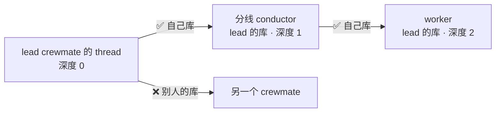
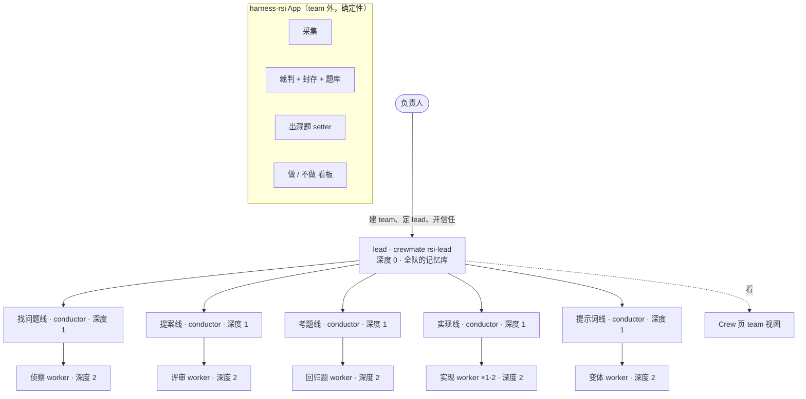
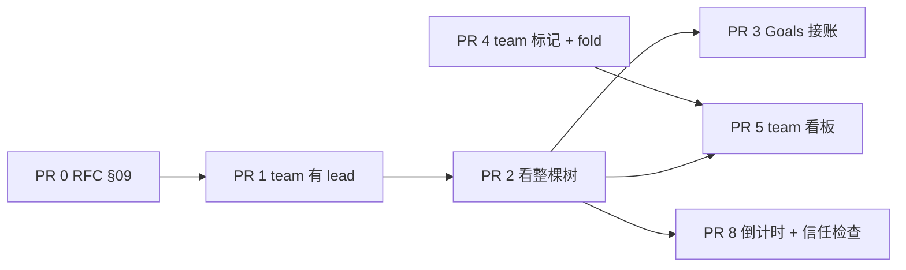
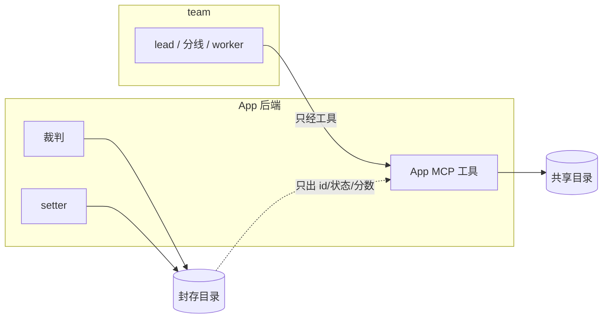
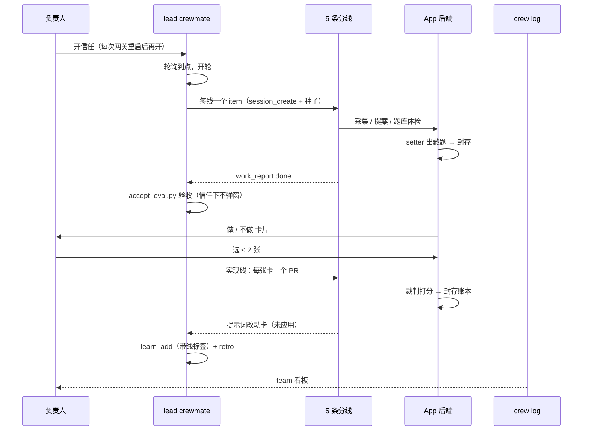
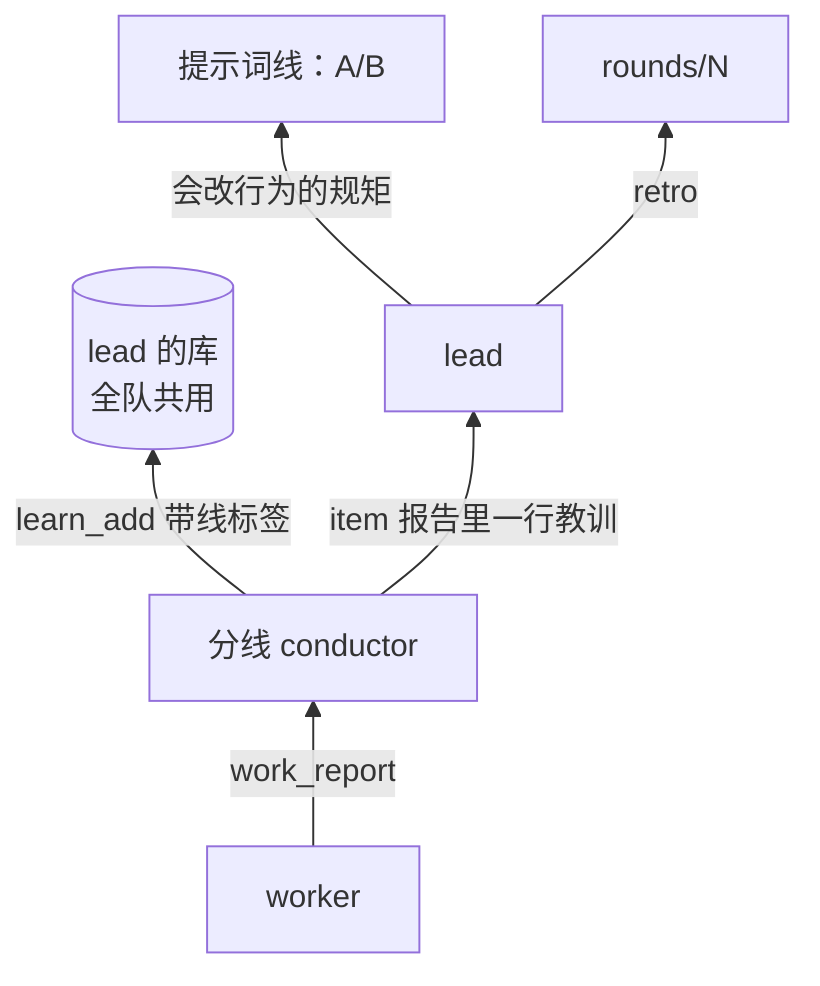
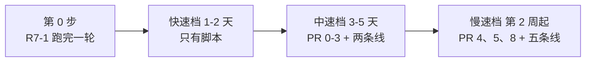
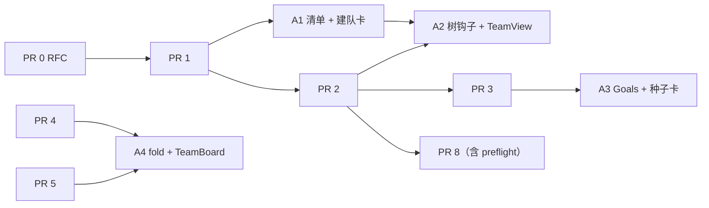
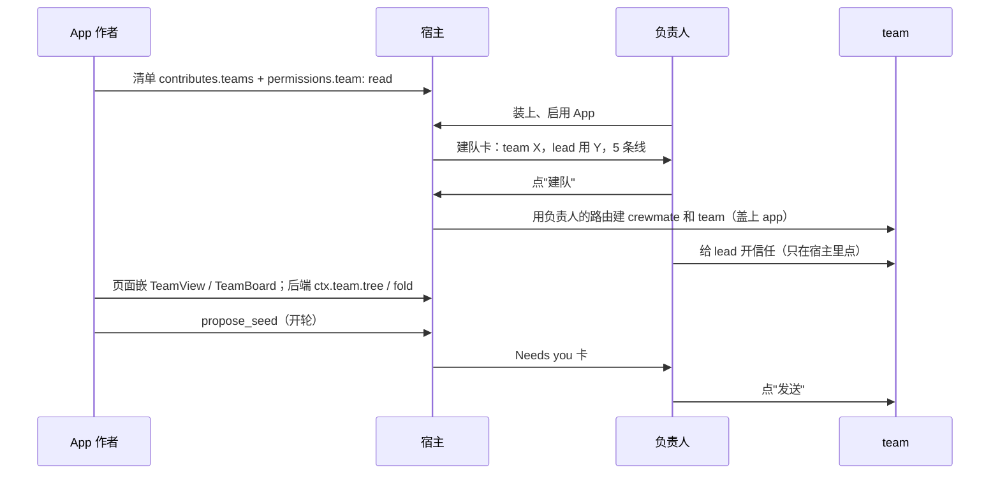

# Harness RSI 团队化设计 v3.1：crewmate lead 带分线 conductor，App 也能用

状态：草案 v0.3.1 · 2026-10-04 · 负责人：iamwhatever · 上级文档：Harness RSI 设计文档（KiroCrew 本地 artifact `harness-rsi`） · 本文件对应 artifact `harness-rsi-crewmate-team` 版本 5；v3 是版本 4，v2 是版本 2

v0.3.1 变更（按负责人对 v3 的裁定）：v3 已批准；新增 §12「App 也能用」——team 能力不只给 Crew 页用，任何 App Kit App 都能通过通用 App SDK 能力用它，harness-rsi 是第一个用户。§1-§11 不变，只在 §5、§11 各加一行指向 §12；原 §12 变成 §13，加了两个问题。

v0.3 变更（按负责人对 v2 的裁定）：

| 改了什么 | v2 | v3 |
|---|---|---|
| lead | conductor 或 crewmate，深度 1 | 一个 crewmate，深度 0（根） |
| 分线 | 5 个 crewmate，深度 2 | 5 个 conductor 会话，在 lead 的库里，深度 1 |
| worker | 分线下面的叶子 | 深度 2，叶子 |
| 记忆 | 每条线自己的库 | lead 和所有分线共用一个私有库（lead 的） |
| 批准 | PR 6 `work_ledger_verify` 工具 | 删掉 PR 6；负责人给 lead 设信任 |
| 排程 | PR 7 让定时任务开轮 | 删掉 PR 7；lead 上挂轮询 |

本文 §1-§11 的"现状"都在 KiroCrew `origin/main` `7279426278`（2026-10-04）上读过代码；§12 在 `efd0181dea`（2026-10-04）上读过。没跑过的地方写"未实测"。

| 词 | 意思 |
|---|---|
| crewmate | 有名字、有自己记忆库的 AI 队友 |
| team | 一组会话，Crew 页上有自己的 team 视图 |
| lead | 带 team 的 crewmate，`rsi-lead` |
| 分线 | lead 开的 conductor 会话，用 lead 的记忆库 |
| 普通 worker | 一次性会话，做完一个 work item 就关 |
| 信任 | 会话上的开关，开了以后工具调用不再弹批准 |
| App 的 team | 由某个 App 的清单提出、负责人点过"建队"的 team，记录上带这个 App 的名字 |

## 1. 目标与非目标

| 目标 | 非目标 |
|---|---|
| 在 Crew 页上一眼看到 team 的全部会话、卡点、预算 | 再做一个只给 RSI 用的页面 |
| 一个 crewmate lead 能开分线、分线能派 worker | 无人值守合并 |
| 看板数字全从 crew log 算，没人能手填 | team 改裁判、考题、打分账本 |
| 一轮跑完零临时批准（靠信任） | 超过深度 2 的嵌套 |
| `harness-rsi` App 只管确定性部分 | 分线各有自己的记忆库 |
| 任何 App 都能声明并读自己的 team（§12） | 为 RSI 写核心代码；App 自己建 crewmate、开信任 |

## 2. 现状：Crew 页带一个 RSI team 会坏在哪

| 部件 | 现在是什么 | 代码位置 | 对 RSI team 的问题 |
|---|---|---|---|
| team 数据 | 只有 `{id, name, members}`；只有负责人能写 | `src/kiro_crew/crew_teams.py` | 没有 lead |
| team 视图 | 三块：状态条、Needs you、本周 | `website/src/pages/members/TeamView.tsx` | 只读每个 crewmate 自己的置顶 thread；lead 开的分线和 worker 不在里面，它们的提问和批准不进 Needs you |
| crewmate 的 Sessions 标签 | 只列 `created_by` 等于该 crewmate thread 的直接子会话 | `MembersPage.tsx` `drivingSessions` | 能看到分线，看不到分线下面的 worker |
| crewmate 的 Goals 标签 | "即将推出"的占位 | `CrewProfilePanel.tsx` | 没接 work ledger |
| Crew board | 一个 conductor 的看板，`/crew-board?conductor=KEY` | `CrewBoardPage.tsx` | 一次只看一本账；lead 的账和分线的账不连 |
| 看板模板注册表 | 机制已有，注册表是空的 | `src/kiro_crew/dashboard_templates/registry.py` | 正好缺第一个用户 |
| crew log | 已记谁开了谁、work ledger 改动、每轮 credits、主机自动拒绝 | `src/kiro_crew/crew_log/entry_types.py`、`session_tree.py` | 没有按 team 汇总的 fold；会话上没有 team 标记 |

先例：`pipeline_board_contract.py` 把面板拆成两半：数字从 fold 算，发布者碰不到；判断字段由 conductor 填。team 看板照做。

## 3. 谁能派发谁

派发要过两道检查，都在 `src/kiro_crew/dashboard/session_control.py`。

| 检查 | 位置 | 什么时候读 | 放行条件 |
|---|---|---|---|
| 自己库 | `create_session` 里的 `_own_store_agreed`（约 2379 行） | 子会话要用某个 crewmate 的库时 | 子会话的库 = 调用者的库，且本进程担保过调用者的身份 |
| 链根 | `_delegation_lineage_fenced`（408 行） | 只在"自己库"不过时 | 沿 `created_by` 往上，根是负责人自己开的标签页 |

crewmate 开会话时，就算指定了 `kirocrew-conductor` 这类模板，模板只换人设，**库还是调用者的**（约 2275 行）。所以 lead 开的分线、分线开的 worker，都落在 lead 的库里，走"自己库"放行。分线建时就被担保（`bind_session_execution(..., vouch=True)`，约 2807 行），所以它再派 worker 也过。

这正好就是负责人要的形状：全队共用 lead 的私有记忆，不需要改安全门。



### 3.1 排程：lead 上挂轮询

每周一轮用 lead 自己 thread 上的轮询（`monitor_start`）触发：轮询在 lead 的 thread 里跑，开分线还是走"自己库"，不经过定时任务。

不走 crewmate 自己的定时任务开分线：按代码读，`cron-<id>` 会话没有被担保（`cron_inject.py` 不调用 `vouch=True`），"自己库"不过，退回链根检查又碰到 `_cron_caller`，会被拒（未实测）。

### 3.2 信任怎么传（已在代码里读过）

| 情况 | 结果 |
|---|---|
| 负责人给 lead 的 thread 开信任 | 之后 lead 开的分线、分线开的 worker 都带上（`create_session` 复制 `_trust`、`_trust_reads`） |
| 按命令的授权 `_trusted_patterns` | 不传 |
| SafetyOverride 的范围 `_trust_scope` | 不传 |
| 网关重启 | 信任只在内存里：lead 和所有子会话都回到"要批准" |
| 重启后负责人重新给 lead 开信任 | 之后新建的子会话带上；重启前建的子会话仍要批准，要单独再开 |
| 建子会话那一刻之前撤销信任 | 子会话生来不信任 |
| PreToolUse 门、治理上限 | 仍高于信任，照样弹或拒 |

重启这一条是最可能坏一轮的地方：重启后旧分线会在没人看的时候卡在 600 秒批准上。对策：重启后 lead 先重开信任，再把旧分线全部关掉重开（item 状态在 work ledger 里，不丢）。

## 4. 新形状



深度上限 2 不变：`work_ledger.MAX_DEPTH = 2`，`child_depth` 超了就拒。lead 0、分线 1、worker 2，worker 不能再派。

### 4.1 角色

| 角色 | 类型 | 底子 | 记住什么 | 工具 |
|---|---|---|---|---|
| lead | crewmate `rsi-lead` | 基于 `kirocrew-conductor`，不写文件 | 负责人的取舍、各线手艺（带线标签） | work ledger、`session_create`、`monitor_start`、App 读工具 |
| 5 条分线 | conductor 会话，用 lead 的库 | 模板 `rsi-lane-*`，基于 `kirocrew-conductor` | 写进 lead 的库，带线标签 | work ledger、`session_create`、本线 App 工具、`work_report` |
| 叶子 | 普通 worker，用 lead 的库 | 现有 `rsi-*` 的 `-w` 版；实现线用 `rsi-builder` | 无 | 本角色最小工具集 |

## 5. Crew 页上的产品改动（每点一个 PR）

PR 0 先行：`rfc-crewmates-launch.md` §09 定死了 team 视图"三块"，加 lead 和看板要先有已接受的修订。PR 6、PR 7 都删掉，编号不重排。



| PR | 改在哪 | 用户看到什么变化 |
|---|---|---|
| 1 team 有 lead | `crew_teams.py` 加可选 `lead: {name}`（只能是 crewmate），只有负责人能写；`TeamDialog.tsx` 加"由谁带" | 编辑 team 时多一个"由谁带"；名册里 team 标题旁出现 lead 的脸 |
| 2 看整棵树 | `GET /api/teams/{id}/tree`：从 lead 的 thread 往下，用 `session_tree.py` 找所有后代；`TeamView.tsx` 改读它 | 分线和 worker 在干活时显示"运行中"；任何后代的提问和待批准都进 Needs you；状态条按"lead → 分线 → worker"缩进 |
| 3 Goals 接账 | Goals 标签读 `/api/crew-board`，按 lead 和它开的分线汇总 | lead 名片的 Goals 显示每条线的目标和 item |
| 4 team 标记 + fold | `session/opened` 加可选 `team`：链根是 team 的 lead 时盖上 team id；`projection.py` 加 `team` fold | 用户暂时看不到；是 PR 5 的数字来源，成员变了历史不跟着变 |
| 5 team 看板 | `registry.py` 第一条 `team-board`：页面 + 合约 + provider + 对齐测试；判断字段由 lead 发布 | team 视图顶部出现看板：第几轮、每线进度、credits 对上限、等你的事 |
| 8 倒计时 + 信任检查 | Needs you 卡片显示待批准剩余时间（600 秒）；team 视图"开轮前检查"：列出树里每个会话的信任状态和 `allowedTools` 缺口 | 卡片上有倒计时；重启后一眼看到哪些会话掉了信任 |

顺序：0 → 1 → 2 → 3；4 可和 1-3 并行；5 等 2 和 4；8 等 2。

每个 PR 让 App 也能用的那一半，见 §12：有的并进同一个 PR，有的是跟在后面的 A 系列 PR。

## 6. harness-rsi App 收缩成确定性部分

| 留在 App | 移走 |
|---|---|
| Slack / GitHub / 会话采集 | 轮次编排 → lead |
| 先例检查 `prior_art.py` | 评审辩论的调度 → 提案线 |
| 裁判 CLI、`validate`、`regress`、`autoscore` | 自动派发 worker → 实现线 |
| 封存目录、题库、setter（后端自己开） | team 进度展示 → team 看板 |
| A/B 计算 `ab.py`（只出数字） | — |
| "做 / 不做"看板（负责人专用路由） | — |
| MCP 工具：`rsi_collect`、`rsi_submit_*`、`rsi_exam_status`、`rsi_ab_run` | — |

"做 / 不做"留在 App 看板，team 伪造不了。team 看板放一条"3 张卡等你"的链接过去。§12.3 写有了 App team 能力以后 App 还能再小多少。

### 6.1 裁判在 team 外（沿用 v2）

| 东西 | 今天在哪 | 今天谁能写 |
|---|---|---|
| 藏题、在用题库、`rejected/` | `~/.kiro/crew/harness-rsi-data/` | 后端；也包括任何同用户的 agent shell |
| 打分账本 `outcomes.jsonl`、`regress/` | 同上 | 同上 |
| setter 提示词 | 同上 | 同上 |
| 裁判代码 `judge/`、`schemas/` | 公开仓库 | 负责人合并 |



| 规矩 | 怎么落实 |
|---|---|
| team 只经 App 工具写共享目录 | 工具做 schema 校验 |
| 封存目录只有后端写 | 过渡：藏题加密、账本每行签名；终态：App SDK 的"封存存储" |
| team 读不到题面 | `rsi_exam_status` 只回 id、状态、原因 |
| 提示词线不改 setter 和变体 worker 的提示词 | `rsi_submit_prompt_change` 的目标允许列表 |
| team 看板不显示裁判分数 | 分数只在 App 页面 |

能打破它的输入（今天成功，过渡后失败）：

```bash
python3 -c "import os,json;open(os.path.expanduser('~/.kiro/crew/harness-rsi-data/outcomes.jsonl'),'a').write(json.dumps({'card_id':'<id>','pr':1,'score':'pass'})+'\n')"
cat ~/.kiro/crew/harness-rsi-data/exams/hidden/*.json
```

信任让这条更要紧：开了信任，上面两行 shell 不再弹窗，没人会看到。过渡方案（加密 + 签名）要在开信任跑第一轮之前落地。

## 7. 一轮的数据流



### 7.1 每层向上报什么

| 谁 → 谁 | 记录 | 验收 | Crew 页上在哪看 |
|---|---|---|---|
| worker → 分线 | `work_report` | `file` 或 `pr_checks` | team 视图的树（PR 2） |
| 分线 → lead | `work_report` | `file`：`rounds/N/<lane>.json`；实现线 `pr_checks` | team 看板每线一行（PR 5） |
| lead → 负责人 | 判断字段 + 通知 | 无（lead 是根） | team 看板顶部；Needs you |

## 8. 零临时批准：靠信任

R7-1 卡住的原因：批准提示 600 秒没人点，主机就拒绝。v3 不加新工具（PR 6 已删），改为负责人在 lead 的 thread 上开信任，信任按 §3.2 传给分线和 worker。

| 会弹的调用 | v3 怎么办 |
|---|---|
| 验收 `accept_eval.py`、预算 `patrol_budget.py`（shell） | 信任下不弹 |
| `session_send`、`session_close` | 信任下不弹；归属检查照旧，只能碰自己开的会话 |
| 分线的 `work_report` | 信任下不弹 |
| 实现 worker 的 shell 和 `git push` | 信任下不弹；`rsi-builder` 的提示词只许推新分支 |
| PreToolUse 门、治理上限拦的调用 | 信任不管用，照样弹或拒；开轮前检查会报出来 |

风险：信任会让 shell 不问就跑，整棵树都是。一个被带偏的 worker 能直接改共享目录、封存目录、推代码，没人会看到弹窗。所以：封存过渡方案先落地（§6.1）；合并仍只有负责人点；信任只开在 lead 的 thread 上。

两道保险：开轮前检查树里每个会话都已信任（PR 8；之前先用脚本），重启后尤其要查；仍出现批准就把该 item 报 `blocked` 并写出工具名，不等 600 秒。

仍要负责人的事：开信任（含每次重启后）、点"做 / 不做"、合并、应用提示词改动、超预算、装 App / MCP / 包、建 crewmate 和 team、定 lead、改裁判和允许列表。

## 9. 预算和停止规则

| 项 | 上限（起点值，第 0 步量完再定） |
|---|---|
| 同时在跑的会话 | lead 1 + 分线 5 + worker ≤ 4 |
| 每轮 worker | ≤ 12 |
| 每轮 PR | ≤ 2 |
| 每轮时长 | ≤ 6 小时（不含等人点"做"） |
| 每轮 credits | team 轮上限 2U（U = 单进程一轮用量） |

| 触发 | 动作 |
|---|---|
| credits 到 80% | 不再派新 item |
| credits 到 100% 或时长到 | 全停，写 retro |
| 同一 item 验收失败 3 次 | 关掉，报给 lead |
| 出现批准提示 | 该 item `blocked`，不等 |
| 网关重启 | lead 停派发，等负责人重开信任，再关掉旧分线重开 |
| 本轮出现一次主机自动拒绝 | 有会话掉了信任；下一轮开不了，先查 §3.2 |
| 封存目录被写、被删、签名不对 | 本轮作废，全停，关信任，通知负责人 |
| 0 条 `NEW` 信号且热度没涨 | 提案前结束 |
| 连续 2 轮 0 张卡被选 | 暂停提案线 |
| 藏题分 vs 回归分差距连续 2 轮变大 | 冻结提示词线 |
| lead 6 小时没有记录 | 停所有分线 |

## 10. 记忆

lead 和所有分线共用一个私有库：lead 的。分线的手艺写进去，带线标签。

| 内容 | 放在哪 |
|---|---|
| 手艺（怎么认出来源坏了） | lead 的库，`learn_add` 带 `lane:找问题` 这类标签 |
| 长一点的本线笔记 | App 共享目录 `lanes/<lane>/notes.md` |
| 负责人的取舍 | lead 的库 + `decisions.jsonl` |
| 信号、提案、A/B 数字 | App 共享目录 |
| 题面、每题分数 | 只在封存目录 |
| Slack 原话、邮箱、密钥 | 都不存（只存总结和链接） |



代价：5 条线共用一个库，召回时会混。带线标签能筛，但不隔离。会改变角色行为的教训一律走提示词线过 A/B，再由负责人点"做"。

## 11. 分档上线



| 档 | 做什么 | 第一天的信心信号 | 现场演示 | 停止线 |
|---|---|---|---|---|
| 第 0 步 | R7-1 用今天的单进程流程跑完一轮，量出 U | 第 5 轮的信号、提案、藏题都在 | App 看板上第 5 轮的卡 | 跑不完 → 先修它 |
| 快速档 | ① **先测重启**：给 lead 开信任 → 开分线 → 分线开 worker → 重启网关 → 看三层都回到"要批准" → 重开 lead 信任 → 新开一个子会话，看它带信任、旧的仍不带；② 实测 §3 的链：lead → 分线 → worker（预期放行）、lead → 别的 crewmate（预期拒绝）；③ team 汇总脚本：从 crew log 折出 R7-1 那一轮；④ 跑 §6.1 两行破坏输入（预期今天成功）；⑤ 信任检查脚本 | 一张表：重启前 / 重启后 / 重开后，三层各自信任与否；3 条链 放/拒 | 现场开一棵三层树，重启一次，再重开信任，新子会话零弹窗 | 重开信任后新子会话仍不带 → 先写一个只改这一处的 PR，别的不开工；lead → 分线被拒 → 停，重读 §3 |
| 中速档 | 封存过渡方案落地；PR 0、1、2、3；lead 用 crewmate，上找问题线和实现线；lead 上挂轮询；照旧跑单进程轮做对照 | 一轮 0 次批准；team 视图里每个在跑的会话都显示"运行中" | 打开 team "Harness RSI"：树按三层缩进，分线一提问就进 Needs you | 漏了侧栏里能看到的会话或待批准；或连续两轮出现批准 |
| 慢速档 | PR 4、5、8；五条线全上 | 连续 3 轮：看板数字 = fold；采纳率不降；藏题分与回归分差距不变大 | team 视图顶部的看板 | 看板数字和 fold 对不上；credits 超上限 |

App 的那一半（§12）：并进 PR 1、2、4、8 的部分随它们走；A1-A4 放慢速档，每个跟在它的核心 PR 后面。快速档加一项实测：用 `kiro_agent = harness-rsi--rsi-lead` 建一个 crewmate，看它能不能从 App 带的 agent 启动（§12.1 的前提，未实测）。

## 12. App 也能用

负责人要的是：team 不只给 Crew 页用，任何 App 都能用。harness-rsi 是第一个用户，但 KiroCrew 里不写一行只给 RSI 的代码。

### 12.1 今天 App 能碰到什么（在 `efd0181dea` 上读过）

| App 今天有的口子 | 代码位置 | 能不能用在 team 上 |
|---|---|---|
| 清单 `agents`：App 带 agent JSON，装上后变成 `<app>--<agent>.json` | `apps/bridges.py` `_register_agents`；规范 `app-kit-platform.md` §3 | 能当 lead 和分线的底子；建 crewmate 时 `kiro_agent` 指它（未实测） |
| 清单 `mcpServers`：App 的 MCP 工具 | `app-kit-platform.md` §1 | 能，lead 和分线用 App 工具 |
| `permissions.api`：App 令牌能调的路由前缀 | `website/src/app-sdk/scopedApi.ts` + 后端令牌检查 | 不能：见下面三行 |
| members、teams 路由 | `dashboard/handlers/members.py:192` `_deny_app_caller`；`handlers/teams.py:123-237` 每个路由都调它 | App 令牌一律 404：App 看不到 crewmate 和 team |
| `/api/crew-board`、crew log 路由 | `handlers/work_ledger_board.py:249` 和 `handlers/crew_log.py` 都先过 `require_owner_dashboard_request` | 只认负责人：App 读不到账和 fold |
| 建 crewmate、建 team | `handlers/agents.py:5435` `_require_owner`；`teams.py` 同上 | 只认负责人：App 建不了（这是对的） |
| `permissions.sessionApproval`：替用户发消息、批准、切到 Trust | `apps/manager.py:1178` 加了它要重新点同意 | 管的是用户自己的会话；不该延伸到 team 的会话（§12.4） |
| 页面 SDK：`useAppApi`、`useChatLauncher`、`ChatEmbed` | `website/src/app-sdk/index.ts` | 有"嵌宿主组件"的先例（`ChatEmbed`），team 组件照做 |
| 后端 SDK：`ctx.cron`、`ctx.spawn`、`ctx.job`、`ctx.storage` | `apps/context.py:55` `AppContext` | 没有 team；`ctx.spawn` 开的是子代理，不是 crewmate 的会话 |
| 看板模板注册表 | `dashboard_templates/registry.py`，开发期核心代码 | App 注册不了模板，只能嵌核心的 |

内置 App 怎么绕过去的：它们跑在网关进程里，直接 `import kiro_crew`。Issue Radar 直接读写 crew log，还在核心 `crew_log/projection.py:179-186` 里放了一个只给它用的 `radar` fold；Auto Improvement 用 `createSlot` / `sendChat` 开会话，后台直接开 `AcpRuntime`。外部 App 走不了这条路；RSI 也不该走，因为它正是"为一个 App 写核心代码"。

结论：今天外部 App 碰不到 team 的任何一块。要加的是一个通用的"App 的 team"能力，按 team 隔离，只读，建队和开信任仍是负责人点。

### 12.2 每个 PR 怎么给 App 用

共同规则：一个 team 只有带着 App 名字（`app`，由负责人点"建队"时盖上）才对这个 App 可见；App 只看到自己的 team，看不到别的 team、别的 crewmate、任何对话内容。

| v3 PR | 给 App 的通用能力 | 改在哪（接缝） | App 作者看到什么 | 放哪个 PR |
|---|---|---|---|---|
| 1 lead | 清单新字段 `contributes.teams[]`：`{id, name, lead: {agent, crewName}, lanes: [{id, agent}]}`；`agent` 指 App 自己带的 agent JSON | `apps/manifest.py` 校验；`apps/bridges.py` 照常把 agent 落盘；`crew_teams.py` 记录加可选 `app`；启用 App 时宿主弹"建队"卡（照 `manager.py` 的 sessionApproval 同意流程） | 写几行清单；用户启用时看到"建 team X，lead 用 Y"；点了才建，crewmate 和 team 都是负责人的路由建的 | `crew_teams.py` 的 `app` 字段并进 PR 1；清单字段 + 建队卡是 **A1** |
| 2 整棵树 | `GET /api/teams/{id}/tree` 对 App 令牌放行，但只限 `team.app` 等于这个 App；只回会话 key、角色、深度、状态、待办数，不回对话 | `handlers/teams.py`：这一个路由把 `_deny_app_caller` 换成"本 App 的 team 才放行"；其余 teams/members 路由不变 | 页面 `useTeamTree(teamId)`；后端 `ctx.team.tree(team_id)` | 路由放行并进 PR 2；SDK 钩子 + 后端 `TeamSDK` 是 **A2** |
| 2 Needs you | 宿主组件 `<TeamView teamId>`：嵌 PR 2 的 team 视图，提问和批准在组件里点，点的人是负责人 | `website/src/app-sdk/index.ts` 加导出（照 `ChatEmbed`） | App 页面里一行组件就有树和 Needs you；App 代码拿不到批准按钮的回调 | **A2** |
| 3 Goals | `ctx.team.goals(team_id)` / `useTeamGoals`：每条线的目标、item 标题、状态、验收类型；不含 worker 的报告正文 | `work_ledger_board.py`：负责人门之外，加一条"该账的会话在本 App 的 team 树里"才放行的只读入口 | App 页面能画自己的进度条 | **A3**（等 PR 3） |
| 4 team fold | `ctx.team.fold(team_id)`：PR 4 的 `team` fold，原样只读；fold 本身通用，不认识任何 App | 新 `apps/team_sdk.py`；`apps/context.py` 加 `team: TeamSDK \| None`，只在 `permissions.team == "read"` 且清单声明了 team 时给 | 后端拿到每轮 credits、会话数、拒绝次数，不用自己解析 crew log | **A4**（等 PR 4） |
| 5 team 看板 | 宿主组件 `<TeamBoard teamId>`：嵌核心的 `team-board` 模板；App 不能加字段，判断字段仍由 lead 发布 | `app-sdk/index.ts` 加导出；`registry.py` 不变，不给 App 注册模板的口子 | App 页面顶部放同一块看板；App 自己的数字（比如裁判分）放 App 自己的区域 | **A4**（等 PR 5） |
| 8 倒计时 + 信任检查 | 树的返回里带 `preflight: {ok, missing: [{session, gap}]}`；组件里有倒计时 | PR 8 加在 tree 路由的返回里，App 读同一份 | 后端开轮前先读 `ctx.team.tree(...).preflight`，不 ok 就不开；"开信任"按钮只在宿主组件里，SDK 没有这个调用 | 并进 PR 8 |
| 给 lead 发种子 | `ctx.team.propose_seed(team_id, text)`：在 Needs you 里放一张"App X 想给 lead 发：……"的卡，负责人点"发送"才发 | 新卡片类型挂在 PR 2 的 Needs you 上；发送走已有的 thread 路径 | App 的"开轮"按钮只是提议；不会自动发 | **A3** |

PR 0 加一节：App SDK 的 team 能力先写 RFC（`docs/request-for-change/`），每个 A 系列 PR 同时改 `docs/app-kit/manifest-reference.md` 和 `api-reference.md`。



### 12.3 一个 App 怎么拿到它的 team



### 12.4 仍只有负责人能做的事

| 事 | 为什么 App 做不了 |
|---|---|
| 建 crewmate、建 team、定 lead、改成员 | App 只能提议；建是负责人路由（`_require_owner`）；`crew-teams/` 对沙箱和 agent 文件工具都封住 |
| 开信任、关信任 | SDK 里没有这个调用；只在宿主组件里点 |
| 批准 team 会话里的工具调用 | 按钮在宿主组件里；`sessionApproval` 不延伸到带 `app` 的 team 的会话 |
| 给 lead 发消息 | 只能 `propose_seed`，负责人点了才发 |
| 合并 PR | 不变 |

风险：tree 路由开给 App 后，App 能看到这个 team 里会话的状态和数量。只限它自己的 team，不含对话；members 隔离（`_deny_app_caller`）对其余所有路由不变。`sessionApproval` 不延伸到 team 会话这一条要写成测试：一个带 `sessionApproval` 的 App 给 team 里的会话切 Trust，预期被拒。

### 12.5 harness-rsi 作为第一个用户：还能再小多少

| 今天（v3 §6）App 或负责人要做的 | 有了 App team 能力以后 |
|---|---|
| README 让负责人手工建 crewmate `rsi-lead`、建 team、选 lead、配 5 个分线模板 | 清单里写 `contributes.teams`；启用时点一次"建队" |
| 分线模板 `rsi-lane-*` 放在用户自己的 agents 目录 | 跟 App 一起发，`harness-rsi--rsi-lane-*`，升级 App 就更新 |
| team 汇总脚本（§11 快速档 ③）自己解析 crew log | 删掉，后端读 `ctx.team.fold` |
| 预算停止（§9 credits 80% / 100%）靠 lead 跑 `patrol_budget.py` | App 后端读 fold，到线就在 App 看板上亮红；停派发仍是 lead 做 |
| 信任检查脚本（§11 快速档 ⑤） | 删掉，读 `preflight` |
| App 页面要自己画进度 | 嵌 `<TeamView>` 和 `<TeamBoard>`；App 页面只剩"做 / 不做"、裁判分、A/B 数字 |
| 开轮靠 lead 的轮询 | 不变；另加 App 页面的"开轮"按钮，走 `propose_seed` |

不动的：采集、先例检查、裁判、封存、题库、setter、A/B、"做 / 不做"看板、MCP 工具都留在 App（§6、§6.1）。封存过渡方案仍要在第一次开信任前落地。

KiroCrew 核心里为 RSI 加的代码：零。`team` fold、`team-board` 模板、tree 路由、`TeamSDK`、两个宿主组件都是通用的，Dev Fleet 这类 App 想要"带一队 agent"也直接用。

## 13. 只有负责人能定的事

1. 信任只开在 lead 的 thread 上、每轮结束就关，可以吗？
2. 同意写 crewmates §09 的 RFC 修订（team 有 lead、加看板）吗？
3. 每轮 credits 上限 2U 可以吗？每周上限多少？
4. 封存过渡方案（加密 + 签名）必须在第一次开信任之前落地，同意吗？
5. `harness-rsi` 仓库的 `judge/`、`schemas/`、`crew/prompts.py` 是否设 CODEOWNERS 只认你？
6. App 的 team 只读、只看自己的、建队和开信任只在你点之后——这个边界可以吗？
7. App SDK 的 team 能力跟 PR 0 写在同一份 RFC 里，还是单独一份？

