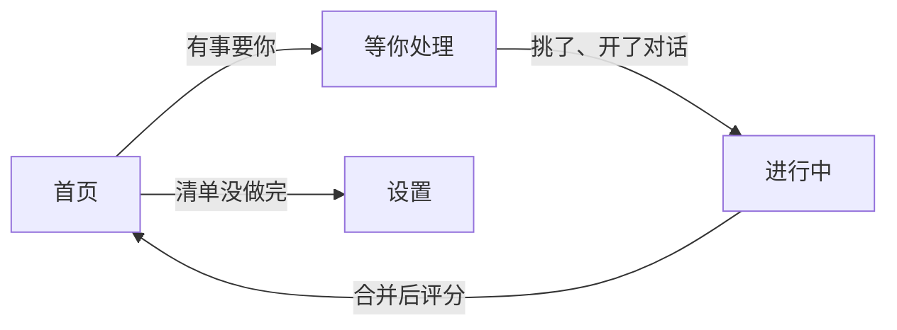

# Harness RSI 界面 v2：规格和样稿

状态：样稿（只在 `?demo=1&ux=v2` 下显示，只用假数据）。现在的页面不变，仍是默认。这份文档不改任何行为。

打开样稿：在应用地址后加 `?demo=1&ux=v2`。代码在 `ui/v2.mjs`，截图在 `ui/screenshots/v2/`（`RSI_UX=v2 node ui/screenshots/shoot.mjs` 重拍）。

## 1. 问题

主人用现在的页面，答不出五个问题：

| 主人的问题 | 现在去哪找 | 为什么找不到 |
|---|---|---|
| A/B 的结果是哪来的？ | 「提示词改动」卡片里的表 | 表只写「第 3、4 轮，各 3 次」，没写是离线重放、哪个脚本、哪天跑的 |
| 怎么让它马上干活？ | 「轮次」页的「运行一轮」 | 藏在第三个标签里；按钮不说要跑多久、花什么 |
| 它是不是按计划在跑？ | 「设置」里的开关 + 「轮次」里的记录 | 两个地方拼；没有「下一轮在什么时候」 |
| 信号是从哪来的？ | 「信号」表的来源列 | 只有一串 `slack:C0…`；没说哪个来源接上了、上次什么时候读的 |
| 怎么派发一个修复？ | 「看板」卡片上先点「做」，再点「派发」 | 两步分在一张很长的卡片上；点了「做」不派发，要读提示才知道 |

根子是同一个：页面按「数据在哪个文件」分标签（看板、信号、轮次、提示词改动、团队、设置），而不是按「主人要干什么」分。

## 2. 主人要干的事，多久一次

| 事 | 多久一次 | v2 放在哪 |
|---|---|---|
| 看它是不是在跑 | 每次打开 | 首页 |
| 看有什么要我处理 | 每天 | 等你处理 |
| 挑要做的修复 | 每轮一次（每周） | 等你处理 |
| 跟着修复走到合并，看有没有用 | 每天，直到合并 | 进行中 |
| 一次性设置 | 第一次，偶尔改 | 设置（首页有清单） |

## 3. 新的结构

四个页面加一个折叠区。现在的六个标签都有去处：

| 现在的标签 | v2 的去处 |
|---|---|
| 看板：未决定的卡片 | 等你处理：「挑一个」 |
| 看板：已选「做」、还没派发的卡片 | 等你处理：「开工作对话」 |
| 看板：已派发的卡片、PR、评分、回归 | 进行中：每张卡一行 |
| 信号 | 首页底部的「明细」（折叠） |
| 轮次 | 首页：上一轮 / 下一轮；明细里留完整记录 |
| 提示词改动 | 等你处理：「换成 B」；原始 A/B 表在明细里 |
| 团队：等你处理 | 等你处理：「回答提问」「看受阻」「合并 PR」 |
| 团队：领队和分线的树 | 进行中：每行链接到它的对话（树本身不再单独显示） |
| 设置 | 设置：每一项带「已接上 / 没设置」 |

## 4. 规则

1. 每个数字写清来源和时间。例：「A/B：离线重放，第 3、4 轮各 3 次，crew/ab.py，01-06 09:00」。
2. 每个按钮写清做什么、花什么。例：「开工作对话 —— 打开 1 个对话，做 1 个 PR，从不合并；今天还能开 2 个」。
3. 空状态给下一步。例：「还没有卡片。下一步：运行一轮（约 1 小时）」。
4. 第一次打开有设置清单，没做完的一步就是首页的主按钮。
5. 每样东西只在一个地方。卡片没决定时在「等你处理」，决定后去「进行中」，不同时出现在两处。
6. 首页只有一个主按钮。

## 5. 每个页面

下表的「读什么」指 `backend/routes.py` 里的路由（都在 `/api/apps/harness-rsi` 下）。**缺口**表示现在的后端没有这份数据，样稿里用假数据或空着，标出来留给后续的 PR。

### 5.1 首页

| 元素 | 显示什么 | 读什么 |
|---|---|---|
| 在不在跑 | 「正在跑第 N 轮，从 HH:MM 开始」或「空闲」 | `GET /round/status`（`running`、`round`、`started_at`） |
| 上一轮 | 「第 4 轮 · 10 个信号 → 3 张卡 · 01-05 10:05 结束」 | `GET /round/status`（`finished_at`、`counts`、`error`） |
| 下一轮 | 「每周一 09:00（网关时间）」或「计划关闭」 | `GET /schedule`（`round_enabled`、`weekday`、`hour`）。**缺口**：后端不回 `next_at`，页面按 `round_due` 的规则自己推算；推算不知道「6 天内跑过就跳过」，后端应直接给出 |
| 计划开关 | 轮次 / 回归 / 评分，各写「开」或「关」 | `GET /schedule` |
| 设置清单 | Slack 命令、KiroCrew 目录、目标仓库、每周计划，各打勾或不打 | `GET /settings`（`command_set`）、`GET /schedule`（`kirocrew_dir`、`round_enabled`）、`GET /dispatch`（`repos`） |
| 主按钮 | 清单第一个没做的步骤；做完了且有事要你，就是「去处理（N）」；否则「现在运行一轮」 | 上面几项 + 等你处理的条数 |
| 运行一轮 | 点两下（先确认）。写清「约 1 小时，花模型额度，只出卡片，不出 PR」 | `POST /round/run`。**缺口**：没有每轮的平均时长和花费；`schedule-runs.jsonl` 的 `cost` 一直是空 |
| 明细（折叠） | 信号表、轮次记录、原始 A/B 表 | `GET /signals`、`GET /schedule`（`runs`）、`GET /prompt-changes` |

### 5.2 等你处理

一条队列。每条写三样：为什么到你这、证据、一个按钮。

| 类型 | 为什么 | 证据 | 按钮 | 读 / 写 |
|---|---|---|---|---|
| 挑一个 | 新卡片，还没决定 | 「N 人 / D 天」+ 来源链接 + 改动大小 | 「做这个」（另有「跳过」） | 读 `GET /proposals`、`GET /signals`；写 `POST /decisions` |
| 开工作对话 | 已选「做」，还没开对话 | 改动大小 + 今天剩几个名额 | 「开工作对话」 | 读 `GET /outcomes`（`dispatches`）、`GET /dispatch`（`daily_cap`）；写 `POST /dispatch/start`。**缺口**：今天已用名额要从 `dispatches` 自己数 |
| 换成 B | 有一份提示词改动等你 | A/B 数字 + 来源和时间 | 「换成 B」 | 读 `GET /prompt-changes`；写 `POST /prompt-changes/decide`。**缺口**：卡片只有 `at`（提议时间），没有 A/B 实际跑的时间和命令 |
| 回答提问 / 看受阻 | 工作对话在问你，或被卡住 | 对话自己的一句话 | 「打开对话」 | 读 `GET /team`（`needs_you`）。这是自报数据，页面照写「自报」 |
| 合并 PR | PR 做完、验收过了 | PR 号 + 评分 | 「打开 PR」（合并在 GitHub 上做） | 读 `GET /team`（`needs_you`，`why=merge`）、`GET /outcomes`（评分）。**缺口**：没有 CI 状态 |

空的时候：「没有要你处理的事。下一轮：每周一 09:00」。

### 5.3 进行中

选了「做」的卡片，每张一行，一排六个格子：

已选 → 已开对话 → PR → CI → 已合并 → 评分

| 格子 | 读什么 |
|---|---|
| 已选 | `GET /proposals`（`decision=do`） |
| 已开对话（链接到对话） | `GET /outcomes`（`dispatches`，或行里的 `dispatch.session`） |
| PR | `GET /outcomes`（`pr`、`state`） |
| CI | **缺口**：后端不读 PR 的检查结果；样稿显示「—」 |
| 已合并 | `GET /outcomes`（`state=merged`、`merged_sha`） |
| 评分 | `GET /outcomes`（`score.base` → `score.head`、`regress`）。写「评分：基线不通过 → 新版通过 · 01-02 10:05」 |

没有卡片关联的 PR（`card_id` 为空）放最后，写清「没有卡片」。空的时候：「还没有在做的。下一步：去「等你处理」挑一个」。

### 5.4 设置

每项先写状态（已接上 / 没设置 / 关），再写怎么改。

| 项 | 状态从哪来 | 读 / 写 |
|---|---|---|
| 来源：Slack | `command_set`、频道数、窗口天数 | `GET/POST /settings` |
| 来源：GitHub issues | 上次读的时间和行数 | `GET /refresh/status`。**缺口**：没有「读哪个仓库」的设置，写死在适配器里 |
| 来源：会话记录 | — | **缺口**：没有开关也没有状态 |
| 计划 | 三个开关 + 星期和钟点 + KiroCrew 目录 | `GET/POST /schedule` |
| 信任 | 工作对话一开始是不是信任模式（带风险说明） | `GET/POST /dispatch`（`trust_dispatched`） |
| 名额 | 每天上限、目标仓库 | `GET/POST /dispatch`（`daily_cap`、`repos`） |

样稿的设置页只显示状态，不能保存；改设置仍在现在的页面里做。

## 6. 缺口汇总

| 缺口 | 影响哪个元素 | 建议 |
|---|---|---|
| 没有下一轮时间 | 首页「下一轮」 | `GET /schedule` 返回 `next_round_at`（用 `round_due` 同一套规则） |
| 没有每轮时长和花费 | 「运行一轮」的花费说明 | `schedule-runs.jsonl` 写上 `cost`；首页显示近 3 轮平均 |
| 没有 A/B 的运行时间和命令 | 「换成 B」的证据 | `crew/ab.py` 在 `ab` 里写 `ran_at` 和 `command` |
| 没有 CI 状态 | 进行中的「CI」格、合并 PR 的证据 | `GET /outcomes` 带上 PR 的检查汇总 |
| 没有今天已用名额 | 「开工作对话」的名额说明 | `GET /dispatch` 返回 `used_today` |
| GitHub 仓库和会话来源没有设置 | 设置的来源区 | 各加一项设置和状态 |

## 7. 不做什么

- 不改后端，不改默认页面，不加新路由。
- 样稿不保存任何东西；点按钮只改内存里的假数据。
- 不删现在的六个标签。v2 被接受后，另开 PR 切换默认页面并补上面的缺口。
